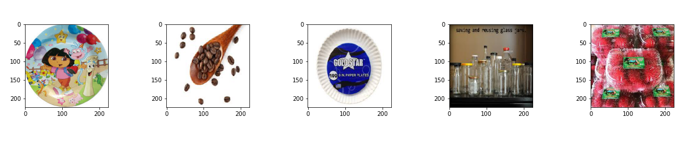

# Waste-Classifier
This is a good starter project for anyone who wants to begin getting their hands dirty with Computer Vision code and put theory into practice!!

We deal here with a simple Binary Classification problem, where we will be classifying content of the images as being Organic or Recyclable.

# Sample:

Input

Output

